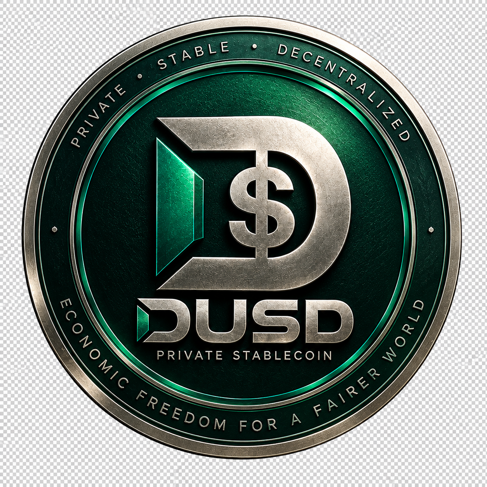

<p align="center">
  
</p>

# DUSD

DUSD is a DERO-native stablecoin protocol built around a DVM-BASIC economic core. Users mint DUSD against DERO collateral, while DUSD is backed by a unified base of protocol-owned liquidity (POL), insurance, and eligible vault collateral. The protocol uses internal price discovery and evaluates its backing continuously before any redemption.

```text
                    ┌───────────────┐
                    │     User      │
                    └───────┬───────┘
                            │
                     Connect Wallet
                            │
             ┌──────────────┴──────────────┐
             │                             │
          Mint DUSD                    POL Swap
             │                             │
       Deposit DERO                 DERO ↔ DUSD
             │                             │
             └──────────────┬──────────────┘
                            │
                     DUSD Protocol
                            │
          ┌─────────────────┼─────────────────┐
          │                 │                 │
        Vaults             POL            Insurance
          │                 │                 │
          └─────────────────┼─────────────────┘
                            │
                     Unified Backing
                            │
                  Coverage / Claim Factor
                            │
                     Redemption
```

DUSD connects users, DERO collateral, Vaults, Protocol-Owned Liquidity (POL), and Insurance into a unified backing system. Users can mint DUSD against DERO and ultimately swap DERO ↔ DUSD through POL. The protocol evaluates its backing through Coverage and Claim Factor, which determine the redemption claim available to DUSD holders.

## Status

| Component | Status |
|---|---|
| V0.5.1 economic state machine | ✅ Complete |
| Economic/invariant testing | ✅ Complete |
| DERO/DVM integration | 🔄 Next |
| Production POL | 🔄 Next |
| Protocol API/read layer | ⏳ Planned |
| Frontend | ⏳ Planned |
| Testnet | ⏳ Planned |
| External security review | ⏳ Planned |
| Production deployment | ⏳ Future |

V0.5.1 is the current economic reference implementation and is ready for continued testnet-oriented development. The complete user-facing protocol is not finished yet.

## What is DUSD?

DUSD is a DERO-native stablecoin protocol designed around:

- **DERO collateral** — DUSD is minted against DERO deposited as collateral.
- **Vault-based debt** — each mint creates a vault/debt position that tracks collateral and DUSD owed.
- **Protocol-Owned Liquidity (POL)** — a protocol-owned DERO/DUSD liquidity pool that provides internal price discovery.
- **Insurance** — an additional backing buffer held by the protocol.
- **Unified backing** — POL, insurance, and eligible vault collateral together form a single backing base behind all DUSD.
- **Internal price discovery** — prices are derived from protocol reserves, not external oracles.
- **TWAP-based risk accounting** — risk-sensitive calculations use a block-anchored TWAP rather than a single spot price.
- **Dynamic lock durations** — heavier mint pressure can lengthen the lock on new collateral.
- **Rolling anti-split protection** — the lock mechanism applies to global and owner-level pressure, so large mints cannot be split into many small ones to bypass it.
- **Pari-passu redemption** — every DUSD holder shares the same proportional claim on the backing.

No version has been deployed to mainnet. All work to date is research/simulator and reference-implementation material.

## How DUSD Works

### Mint

1. A user deposits DERO.
2. The protocol calculates the allowed DUSD amount.
3. A vault/debt position is created.
4. DUSD is issued under the protocol rules.

Mint price:

```text
mint_price = min(P0, TWAP)
```

Reference price:

```text
P0 = 0.01 DUSD/DERO
```

`P0` is an initial/reference issuance price. It is **not** a permanent floor and **not** a guaranteed peg.

### Use DUSD

DUSD is intended to be used within the DERO ecosystem and, ultimately, traded through POL.

### Redeem

Users can redeem DUSD according to the current backing state. The redemption claim depends on the protocol's **Coverage** and **Claim Factor**.

## Economic Model

The protocol combines POL, insurance, and eligible vault collateral into a single backing valuation.

| Component | NAV |
|---|---|
| POL | `POL_NAV = Y + P_risk × X` |
| Insurance | `Insurance_NAV = I_DUSD + P_risk × I_DERO` |
| Eligible collateral | `Collateral_NAV = H × P_risk × C` |
| **Backing** | `Backing_NAV = POL_NAV + Insurance_NAV + Collateral_NAV` |

Where `X` is the POL DERO reserve, `Y` is the POL DUSD reserve, `P_risk` is the risk price, `I_*` are insurance reserves, `C` is eligible collateral, and `H` is the collateral liquidity haircut.

Backing is measured against outstanding DUSD:

```text
Coverage     = Backing_NAV / Outstanding DUSD
ClaimFactor  = min(1, Coverage)
```

- `Coverage >= 1` → Claim Factor = 1.
- `Coverage < 1` → Claim Factor falls below 1.

The protocol explicitly represents deterioration in backing instead of assuming full redemption under arbitrary collateral conditions. This is not a claim of guaranteed solvency.

## Unified Backing

DUSD is designed as a **pari-passu senior claim** on the unified backing base, which consists of:

- POL
- Insurance
- eligible vault collateral

The unified backing is what stands behind every DUSD, and it is evaluated as a whole before any redemption is settled. This creates a unified accounting view of the assets supporting outstanding DUSD; it does not by itself guarantee solvency or market stability.

## POL — Protocol-Owned Liquidity

POL is the protocol-owned liquidity layer. Its reserves are:

```text
X = DERO reserve
Y = DUSD reserve
```

Spot price:

```text
P_spot = Y / X
```

The current model is a constant-product AMM with a **0.30% swap fee**.

The eventual user interface should expose:

- spot price
- expected output
- fee
- price impact
- available liquidity

### Critical rule

**POL never creates DERO.**

DERO entering POL must come from real protocol or user deposits.

### Fee attribution

| Allocation | Share |
|---|---:|
| POL depth | 70% |
| POL growth | 10% |
| Active backers | 15% |
| Insurance | 5% |
| **Total** | **100%** |

These are economic attribution categories for the swap fee. They do not represent extra asset creation.

## Spot Price vs Risk Price

- **Spot price** (`P_spot = Y / X`) is used for immediate POL swaps.
- **Risk price** is a block-anchored TWAP used for risk-sensitive calculations.

Current TWAP window:

```text
TWAP_WINDOW = 30 blocks
```

Spot and risk prices serve different purposes. The protocol does not treat a single instantaneous swap price as its only risk reference.

## Redemption and Claim Factor

DUSD is designed as a pari-passu senior claim on the unified backing.

Claim Factor:

```text
ClaimFactor = min(1, Coverage)
```

A redemption of `q` DUSD has a target claim value of:

```text
q × ClaimFactor
```

DERO redemption settlement uses:

```text
max(TWAP, Spot)
```

If `Coverage < 1`, the Claim Factor falls below 1 and the resulting shortfall is explicitly represented through the protocol's bad-debt/writeoff accounting where applicable. The protocol does not guarantee a flat $1 redemption under arbitrary market conditions.

## How Risk Is Handled

The current design uses:

- global DUSD ceiling
- minimum-coverage mint gate
- dynamic lock duration
- global rolling anti-split protection
- provenance restrictions on POL-origin DERO
- Coverage / Claim Factor
- explicit bad-debt accounting
- conservation-preserving fee accounting
- bounded arithmetic
- invariant and fuzz testing

Current important parameters:

```text
MIN_COVERAGE   = 1.00
LIQ_CR         = 1.20
GLOBAL_CEILING = 250,000 DUSD
TWAP_WINDOW    = 30
```

### Resilience by Design

```text
DERO price falls
        ↓
Backing NAV falls
        ↓
Coverage falls
        ↓
Claim Factor falls
        ↓
Redemption haircut increases
```

This is a risk-management mechanism, not a guarantee of stability, solvency, or full redemption.

## V0.5.1 Verification

The final V0.5.1 verification battery contains 53 passed / 0 failed tests.

| Component | Result |
|---|---:|
| **Final verification battery** | **53 passed / 0 failed** |
| Adversarial tests | 26 |
| Unit tests | 11 |
| Crash-matrix test | 1 |
| Fuzz test | 1 |
| Fuzz-V0.5.1 test | 1 |
| Monte Carlo test | 1 |
| Closure tests | 12 |
| **Total** | **53** |

Committed verification evidence:

```text
fuzz:        102,400 rounds / 676,838 committed / 0 violations
Monte Carlo: 60,000 × 8 = 480,000 transitions / 0 violations
crash matrix: 36 cells
```

Earlier reported counts (e.g. 41 passed / 0 failed) are historical and are **not** the final battery.

This battery is **not** a formal verification, an external audit, a proof of solvency, or a proof of market stability. It verifies the reference implementation against the economic invariants in this repository.

In the documentation the verdict on the reference engine is `V0.5.1: READY FOR TESTNET EVALUATION` — an evaluation status, not a mainnet deployment.

See the detailed reports in [`docs/`](docs/), including the [V0.5.1 test report](docs/V0.5.1-TEST-REPORT.md), [compliance audit](docs/V0.5.1-COMPLIANCE-AUDIT.md), [implementation report](docs/V0.5.1-IMPLEMENTATION-REPORT.md), and the [state-machine spec](spec/DUSD-V0.5.1-STATE-MACHINE-SPEC.md).

## Roadmap

### Phase 1 — Economic Core

**Status: Complete**

V0.5.1 state machine and verification.

### Phase 2 — DERO / DVM Integration

**Status: Next**

Real DERO/DVM integration: DERO deposits, vault creation, DUSD mint/burn, repayment, collateral withdrawal, liquidation, and provenance enforcement.

### Phase 3 — Production POL

**Status: Next**

DERO ↔ DUSD swaps, reserves, 0.30% fee, price calculation, liquidity accounting, TWAP observations, and conservation-preserving settlement.

### Phase 4 — Protocol API / Read Layer

**Status: Planned**

Expose DUSD supply, POL reserves, spot price, TWAP, Coverage, Claim Factor, insurance, collateral, vaults, debt, and lock status.

### Phase 5 — Final Frontend

**Status: Planned**

Dashboard, wallet connection, minting, vaults, POL swaps, and redemption.

### Phase 6 — Testnet

**Status: Planned**

Full integration and testing of mint, swaps, repayment, redemption, liquidation, extreme conditions, conservation, and invariants.

### Phase 7 — External Security Review

**Status: Planned**

Independent code and economic review, plus an external security audit.

### Phase 8 — Production

**Status: Future**

Only after successful testnet operation and security review.

## Repository

The repository is organized so readers can move from this overview into the implementation and verification material.

```
stableCoin-DUSD/
├── README.md
├── .gitignore
├── assets/
├── core/
├── dvm/
├── spec/
├── tests/
├── docs/
├── v0.5/
└── archive/
    ├── v0.2/
    ├── v0.3/
    ├── v0.4/
    └── v0.5/
```

```text
core/      Economic implementation
dvm/       DVM integration work
spec/      Protocol specifications
tests/     Test suite
docs/      Documentation and verification evidence
v0.5/      Current V0.5.1 contract/closure material
archive/   Historical versions and superseded experiments
assets/    Project assets
```

## Limitations

- Production DERO/DVM integration is not complete.
- Production POL is not complete.
- The final frontend is not complete.
- Testnet deployment is not complete.
- External security review is not complete.
- Market behavior cannot be guaranteed.
- Full redemption cannot be guaranteed under arbitrary collateral collapse.

## Disclaimer

DUSD is experimental software.

V0.5.1 is the current economic reference implementation and is intended for continued development and testnet evaluation.

The complete production system is not yet finished and has not received an independent external security audit.

Nothing in this README should be interpreted as a guarantee of price stability, solvency, liquidity, or redemption value under arbitrary market conditions.